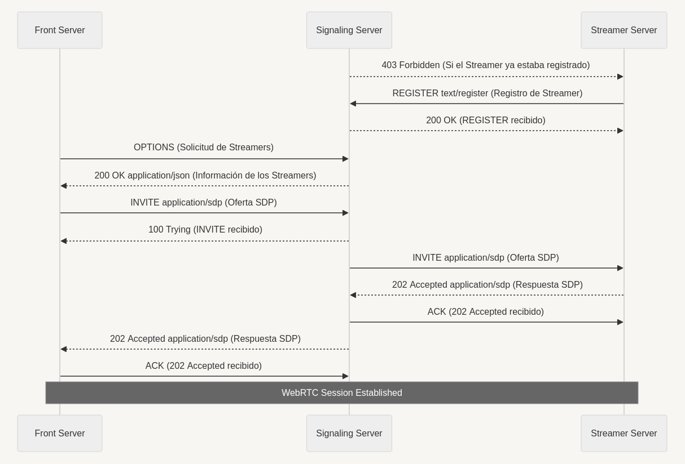

# Entrega Convocatoria Junio
Diego Sota Rebollo: d.sota.2020@alumnos.urjc.es

## Parte Básica
### Front:
Servidor encargado de recibir peticiones HTTP de los clientes. 
Al recibir cualquier petición index comprueba si hay un puerto udp abierto y si no lo hay, lo abre.
Recibe mensajes POST de los clientes para registrarlos en la base de datos, que es un diccionario con clave el nombre del cliente y valor el identificador de la sesión de señalización. 

Al recibir una petición solicitando información de los streamers activos, si el cliente está registado, crea una sesión de señalización y la propaga al servidor de señalización.
Recibe la respuesta del servidor de señalización, y genera una respuesta HTTP para el cliente propagando la información de los streamers activos.

Cuando recibe un POST con el streamer seleccionado, lo almacena.
Posteriormente, se recibe un POST que contiene un JSON con la oferta en su campo content. 
Se extrae esta oferta y se envía al servidor de señalización para que la propague al streamer correspondiente.
Se recibe la respuesta del servidor de señalización y se envía al cliente.

IMPORTANTE: Se debe evitar utilizar firefox para recibir el stream de video, ya que no es capaz de recibirlo. 
Se ha comprobado el correcto funcionamiento con Chrome y Opera.

### Signaling:
Servidor que da soporte a la señalización entre streamers y servidores frontales.
El programa, al arrancar, abre una conexión UDP. 

Recibe los mensajes de registro de los streamers y los almacena en el directorio para poder ofrecer la información a los servidores frontales.
Atiende las peticiones de los servidores frontales para obtener la información de los streamers activos y les envía la información correspondiente.

Acepta las ofertas de los clientes y las propaga a los streamers correspondientes.
Recibe las respuestas de los streamers y las propaga a los clientes correspondientes.
    

### Streamer:
Servidor que realiza la transmisión de audio y video via sesión de WebRTC con los clientes.
Al iniciar el programa, enviará un mensaje de registro al servidor de señalización con la información que será ofrecida a los clientes.

Recibe mensajes de oferta para iniciar la descripción de sesión WebRTC con el cliente. 
Se genera un mensaje de descripción de sesión en respuesta y se envía al servidor de señalización.
Además, el streamer añade el stream de audio y de video a la sesión WebRTC para que se transmita al cliente una vez resuelta la descripción de sesión.


## Parte Opcional

* ### Otro: REPOSITORIO GIT:
  * Se ha creado un repositorio conjunto en GitLab para el proyecto, ya que ha sido creado de forma conjunta por David Santa Cruz y Diego Sota.
  * Se adjunta el enlace al repositorio: [Repositorio GitLab](https://gitlab.eif.urjc.es/ptavi1/p11-final)
  * No se considera una mejora, se incluye aquí por más claridad.

* ### Mensajes SIP y Clases _Rustic_:
   Para la señalización se utiliza la librería asyncio para abrir un puerto UDP.
    
    Por esto es necesaria una clase para manejar la conexión UDP.
    Se ha considerado interesante mantener una única conexión UDP para cada programa, de forma que una clase UDP da soporte a todas las sesiones de señalización.
    
    Además, estas sesiones de señalización tratan de emular el comportamiento de SIP. 
    Por tanto, se han creado clases que representan los mensajes SIP y que se encargan de su envío y recepción.
    
    La idea fundamental ha sido crear dos clases que sirvan como protocolo general, de forma que se puedan adaptar al uso específico de cada servidor mediante herencia.
    Además, para facilitar el manejo de los mensajes recibidos, se ha creado una tercera clase.

  * #### Clase _RusticSipMessage_:
    
      Esta clase no tiene métodos. 
      Los objetos se construyen recibiendo un mensaje SIP en forma de string.
      El constructor extrae los campos del mensaje y los almacena en el estado.
        
  * #### Clase _RusticSipProtocol_:
    
      Esta clase genera objetos representan una sesión SIP.
      Se construyen a partir de una dupla [ip, puerto] que identifica la dirección fuente, un nombre (campo User-Agent) y opcionalmente el identificador de la llamada, 
      con el fin de poder generar objetos asociados a una sesión ya creada, en respuesta a un primer mensaje recibido. Si no se introduce, se genera un identificador aleatorio.
        
      El estado de la clase almacena los datos necesarios para la generación de mensajes SIP.
        
      Tiene dos métodos que gestionan la recepción y el envío de mensajes: greeting y response. 
      Estos deben ser implementados por las clases hijas, y serán ejecutados a nivel de UDP.
      Greeting se ejecuta sin necesidad de haber recibido un mensaje previo.
      Response se ejecuta en respuesta a un mensaje previo, que recibe como argumento, en forma de objeto RusticSipMessage.
      Las clases hijas implementan la respuesta en un bloque condicional que discrimina según el tipo de mensaje recibido.
        
      La clase da soporte para la generación de mensajes mediante la ejecución de un método que modifique los atributos necesarios, y otro que genere el mensaje en forma de string.
        
      Se implementa un método por cada tipo de mensaje SIP que se quiera enviar o recibir, que modifica los atributos necesarios.
      Se implementa un método que recibe el tipo de mensaje y lo genera en forma de string.
        
      Por último implementan dos métodos de envío, uno que garantiza la recepción del mensaje y otro que no.
        
  * #### Clase _RusticUdpProtocol_:
    
    Esta clase genera objetos que representan una conexión UDP, y que manejan un conjunto de objetos _RusticSipProtocol_.
    Se construyen a partir de una dupla [ip, puerto] que identifica la dirección fuente, y una clase hija de _RusticSipProtocol_ que se utilizará para generar los objetos SIP.
        
    La clase es hija de DatagramProtocol, y por tanto implementa los métodos de envío y recepción de mensajes UDP requeridos por asyncio.
        
    El metodo connection_made se encarga de abrir la conexión UDP, y de modificar un atributo booleano para registrar esto.
        
    El metodo datagram_received se encarga de recibir los mensajes SIP. Transforma este mensaje en un objeto RusticSipMessage.
    A continuación, busca en el diccionario de sesiones activas si existe una sesión con el Call-ID del mensaje recibido.
    Si no existe, crea una nueva sesión y la añade al diccionario. Finalmente, ejecuta el método response de la sesión correspondiente.

    Adicionalmente, se implementan dos métodos adicionales:
        
    El metodo create_sip_session genera un objeto RusticSipProtocol a partir de un nombre y un Call-ID, opcional. 
    Lo añade a un diccionario que almacena las sesiones activas, con clave el Call-ID. Además devuelve el valor de este Call-ID.
        
    El metodo ensure_greeting recibe un Call-ID y, en función de este, ejecuta el metodo greeting del la conexión SIP correspondiente. 
    No garantiza que este exista, por lo que se debe ejecutar siempre después de create_sip_session. 
    Esto es así porque en la práctica la sesión de interés no existe, este método es siempre el primero en ejecutarse.

  * #### Peticiones contempladas:
    * REGISTER: Los streamers lo envían al servidor de señalización para registrar un streamer.
    * OPTIONS: Los streamers lo envían al servidor de señalización para obtener la información de los streamers activos.
    * INVITE: Los servidores frontales lo envían al para iniciar una sesión de señalización con un streamer. El servidor de señalización lo propaga.
    * ACK: Los servidores frontales lo envían al servidor de señalización para confirmar la recepción de una respuesta 202 Accepted. 
    El servidor de señalización lo envía a los streamers en respuesta a este mismo mensaje.
    * BYE: Los servidores frontales lo envían para finalizar una sesión de señalización con un streamer a traves del servidor de señalización. Este mensaje no está implementado en el programa.
    * CANCEL: Mensaje previsto para manejar errores en la red. No está implementado en el programa.

  * #### Respuestas contempladas:
      * 100 Trying: Respuesta provisional que indica al servidor frontal que el servidor de señalización ha recibido la petición y está transmitiendosela al Streamer.
      * 200 OK: Mensaje multiproposito. Lo envía el servidor de señalización. Indica que la petición ha sido recibida y procesada correctamente.
    En el caso del Streamer responde al mensaje REGISTER, y en el caso del servidor fontal responde al mensaje OPTIONS con la información de los streamers activos.
      * 202 Accepted: Respuesta a INVITE. Se propaga en sentido inverso por la red y contiene la respuesta a la petición de transmisión.
      * 403 Forbidden: Se envía al arrancar el servidor de señalización a todos los streamers registrados, para que sepan que han sido olvidados y puedan registrarse de nuevo.
 
  * #### A continuación, se muestra un diagrama de clases que representa la estructura de los servidores y la señalización entre ellos:
    

  * No es necesario tener nada en cuenta a la hora de ejecutar el programa para comprobar la funcionalidad. 
  Se puede comprobar en las capturas de red.


* ### Base de datos persistente con XML:
    En el servidor de señalización se ha implementado una clase que accede al archivo data.xml, y que permite la lectura y escritura de los datos almacenados en este archivo.
    La estructura de la base de datos es la siguiente:
 
    ```xml
        <data-base>
            <streamers>
                <streamer>
                    <address>127.0.0.1:9997</address>
                    <name>streamer</name>
                    <call_id>b987842c-8e19-41d4-afb5-3edb76cf03b4</call_id>
                    <info>
                        <image>Prueba de streaming</image>
                        <description>Prueba de streaming</description>
                    </info>
                </streamer>
            </streamers>
            <sessions>
                <session>
                    <addresses>
                        <front>127.0.0.1:5065</front>
                        <streamer>127.0.0.1:9997</streamer>
                    </addresses>
                    <name>diego</name>
                    <call_id>4386f46a-276e-41bb-9494-0259c672c295</call_id>
                    <sdp>
                        <offer>None</offer>
                        <answer>None</answer>
                    </sdp>
                    <state>connection-established</state>
                </session>
            </sessions>
        </data-base>
    ```          
    Como se puede apreciar, la base de datos se compone de dos secciones, una para los streamers y otra para las sesiones.

    La sección de streamers es el directorio mencionado en el enunciado de la práctica, y lo que se sirve a los clientes en formato JSON.
    Al arrancar la ejecución del servidor de señalización, se lee el archivo data.xml y se borra, enviando un mensaje de olvido a todos los streamers registrados, a fin de que vuelvan a registrarse si lo reciben.

    Ofrece soporte para el envío de información adicional, como una imagen o una descripción. Por desgracia, no se ha implementado la funcionalidad de envío de esta información a los clientes.
    La sección sessions contiene la información de las sesiones de señalización activas. No tiene un uso más allá de reflejar el estado de las sesiones.
    
    No es necesario tener nada en cuenta a la hora de ejecutar el programa para comprobar la funcionalidad. 
    Se puede comprobar en el archivo data.xml dentro del directorio _Signaling_.


* ### Otro: Envíos sin perdidas:
    La clase RusticUdpProtocol ha sido modificada para que se puedan enviar mensajes garantizando el envío. 
    Estos mensajes en concreto son los mensajes REGISTER, OPTIONS, INVITE y 202 Accepted.
    El funcionamiento consiste en enviar el mensaje en bucle hasta que se reciba la respuesta correspondiente.


* ### Otro: Mejoras en el la web servida por el servidor frontal.

  * Todos los mensajes POST que recibe son de tipo JSON y tienen la siguiente estructura:
    ```json
    {
        "name": "nombre",
        "content": "contenido encapuslado en {}"
    }
    ```
  * Se ha mejorado la interfaz de la web con CSS
  * Se ha añadido un registro para seleccionar un nombre de usuario

* ### Video de demostración:
  * Se adjunta un video de demostración de la funcionalidad del programa:
  [Video de demostración](https://youtu.be/CicANQ_7Cw0?si=iKjXsES8kjunOL35)

* ## Errores y trabajo no realidado:
  * Tras la señalización en front.py y streamer.py, salen errores en la terminal. 
  Estos errores no afectan al funcionamiento del programa, pero se deben corregir.

  * El navegador Firefox no es capaz de recibir el stream de video.
  
  * No se ha implementado la funcionalidad de envío de información adicional a los clientes.

  * No se ha implementado la funcionalidad de envío de mensajes BYE y CANCEL.

  * Copiar historial del grupo de GitLab

  * Test Unitarios

  * Argumentos por defecto

  * Limpiar connections en la base de datos en signaling.py

  * No hemos sido capaces de generar capturas .libcap en WireShark. Se adjuntan en formato .pcap 